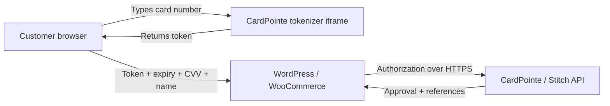

# Data and privacy

This page explains what **Stitch Payments for WooCommerce** stores on your WordPress site, how card data is tokenized, and what you should disclose in your store privacy policy.

For saved-card behavior from a customer perspective, see [Stored payment methods](/docs/merchants/stored-payments).

## Summary

| Data type | Stored on your site? |
|-----------|----------------------|
| Full card number (PAN) | **No** — entered in a CardPointe hosted iframe; only a token is sent to your server |
| CVV / security code | **No** — never written to the database; held in memory only for the authorization request |
| Card tokenizer token | **Temporarily** on the order during checkout, then deleted after processing |
| Last four digits, card brand, expiry | **Yes** — on saved payment tokens (when the customer opts in) and in CardPointe merchant records |
| Transaction references | **Yes** — on orders for refunds, support, and accounting |
| API credentials | **Yes** — in WordPress options (encrypted at rest depends on your hosting) |

Card processing itself is performed by **Stitch / CardPointe** over HTTPS. Your site sends authorization requests; it does not store raw card numbers in the database.

## How card tokenization works

The card number field is not a normal HTML input on your site. It is loaded inside a **CardPointe hosted iframe tokenizer** (`ajax-tokenizer.html`). When the customer types their card number:

1. The number stays inside CardPointe’s tokenizer environment.
2. CardPointe returns a **single-use token** string to the checkout form.
3. Only that token (not the full card number) is posted to WordPress with the order.

Expiry, CVV, and cardholder name are collected in standard checkout fields on your site. They are required to complete the authorization. The **CVV is never written to the database** — it is held in memory only for the authorization request. Expiry and cardholder name may be attached to the order briefly during Blocks checkout and are removed in the cleanup step (see below).

This design reduces PCI scope for your WordPress installation because sensitive card entry happens in CardPointe’s hosted field, not in your theme or database.

## During checkout — temporary data

While an order is being paid, the plugin may briefly attach some checkout fields to the order as metadata (for example during Blocks checkout). These keys are **removed in a cleanup step after every payment attempt**, whether the payment succeeds or fails:

| Order meta key | Contents |
|----------------|----------|
| `_stitch_token` | CardPointe tokenizer token |
| `_stitch_card_expiry` | Expiry entered at checkout |
| `_stitch_card_name` | Cardholder name |
| `_stitch_save_payment_method` | Whether the customer chose to save the card |

The **CVV is deliberately excluded from order metadata**. During Blocks checkout it is held in a request-scoped in-memory store for the duration of the authorization request and discarded immediately afterward, so it is never written to the database. Full card numbers never reach your server at all.

## After payment — what stays on orders

For refunds, voids, subscription renewals, and merchant accounting, the plugin keeps **non-sensitive transaction references** on WooCommerce orders (and related subscriptions):

| Order meta key | Purpose |
|----------------|---------|
| `_stitch_retref` | CardPointe transaction reference |
| `_stitch_authcode` | Authorization code |
| `_stitch_merchant_id` | Merchant ID used for the charge |
| `_stitch_profile_id` | CardPointe profile ID (when a saved profile was used) |
| `_stitch_acct_id` | CardPointe account ID within the profile |
| `_stitch_refund_retrefs` | Comma-separated refund transaction references |
| `_stitch_surcharge_amount` | Disclosed surcharge amount (when enabled) |

These records are **intentionally kept** even if you enable plugin data removal on uninstall, so you retain payment history for accounting and chargebacks.

## Saved payment methods

When [stored payment methods](/docs/merchants/stored-payments) are enabled and the customer opts in, cards are saved as WooCommerce payment tokens (`WC_Payment_Token_Stitch`). Each token stores:

| Field | Description |
|-------|-------------|
| `profile_id` | CardPointe customer profile identifier |
| `acct_id` | CardPointe account identifier within that profile |
| `last_four` | Last four digits for display |
| `card_type` | Card brand label (e.g. Visa) |
| `expiry` | Expiry month/year |
| `name` | Cardholder name |

The token’s internal reference is a combination of profile and account IDs — **not** a full card number. CardPointe holds the vaulted payment credentials; your site stores opaque IDs plus display metadata.

Customers can delete saved cards from **My Account → Payment methods**. That removes the WooCommerce token; profile cleanup on the CardPointe side may require additional merchant configuration.

### Customer profile identifier

Logged-in customers who save a card may also have user meta `_stitch_profile_id`, linking their WordPress account to a CardPointe profile for future saved cards.

## Data sent to Stitch / CardPointe

Payment requests are sent to your configured CardPointe REST API base URL (test or production). Typical authorization payloads include:

- Token or saved profile/account identifiers
- Order amount and currency
- Billing name and address from the WooCommerce order
- CVV and expiry (for new-card payments)
- Merchant ID and capture settings

All communication uses **HTTPS**. API username and password are stored in the gateway settings option `woocommerce_stitch_settings` in your WordPress database.

## Logging

The plugin can write to **WooCommerce logs** (`wp-content/uploads/wc-logs/`):

| Log source prefix | Typical use |
|-------------------|-------------|
| `wc-stitch` | Gateway and payment events |
| `wc-stitch-api` | API request/response diagnostics |
| `wc-stitch-surcharge` | Surcharge-related API calls |

API logging **redacts** sensitive fields such as `token`, `account`, `cvv` / `cvv2`, and passwords before writing log lines.

**Enhanced debug logging** (under **Other settings**) increases verbosity for troubleshooting. Keep it **disabled in production** unless support asks you to enable it temporarily.

## Webhook URL

Gateway settings display a **Webhook URL** (WooCommerce API endpoint) to register in your CardPointe merchant dashboard for transaction notifications. Configure this if your Stitch/CardPointe integration requires asynchronous status updates.

## Plugin configuration stored in WordPress

| Storage | Contents |
|---------|----------|
| `woocommerce_stitch_settings` | Gateway title, credentials, checkout display toggles, surcharge settings, debug logging, uninstall cleanup preference |
| Validation transients | Short-lived admin notices after credential checks |
| WooCommerce payment token tables | Saved Stitch tokens when customers opt in |
| User meta `_stitch_profile_id` | CardPointe profile link per customer |

## Deactivation and uninstall

| Action | Effect |
|--------|--------|
| **Deactivate plugin** | No data is deleted |
| **Delete plugin** (default) | Settings, tokens, profile IDs, transients, and plugin log files **remain** |
| **Delete plugin** with **Remove plugin data when the plugin is deleted** enabled | Removes gateway settings, Stitch payment tokens, customer profile identifiers, transients, and plugin log files — **order and subscription payment metadata listed above is still retained** |

Review these options under **WooCommerce → Settings → Payments → Stitch → Data Retention**. The settings screen includes a **Data retention reference** summary you can copy into your site privacy policy.

## Privacy policy and compliance

As the store owner, you are responsible for your site’s privacy policy and lawful basis for processing customer data. Consider documenting:

1. **Payment processor** — Stitch / CardPointe processes card payments on your behalf.
2. **What you collect** — billing details, order history, and (if enabled) saved payment method display data.
3. **What you do not store** — full card numbers and CVV after checkout completes.
4. **Customer choices** — saved cards require a logged-in account and explicit opt-in at checkout (except subscription flows that require a reusable method).
5. **Retention** — order payment references are kept for accounting; uninstall cleanup options above.
6. **Third-party transfer** — payment data transmitted to CardPointe for authorization, capture, refunds, voids, and stored profiles.

This documentation is a technical reference for merchants and is **not legal advice**. Consult qualified counsel for PCI, GDPR, CCPA, or other regulatory obligations in your jurisdiction.

## Quick reference in admin

Open **WooCommerce → Settings → Payments → Stitch** and scroll to **Data Retention** for the live policy summary generated from the plugin’s retention rules — useful when updating your privacy policy or answering customer data requests.
